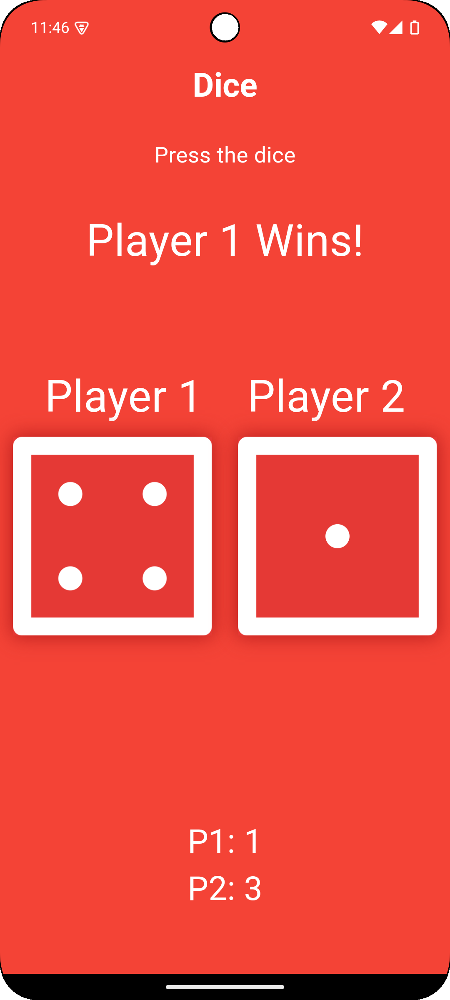
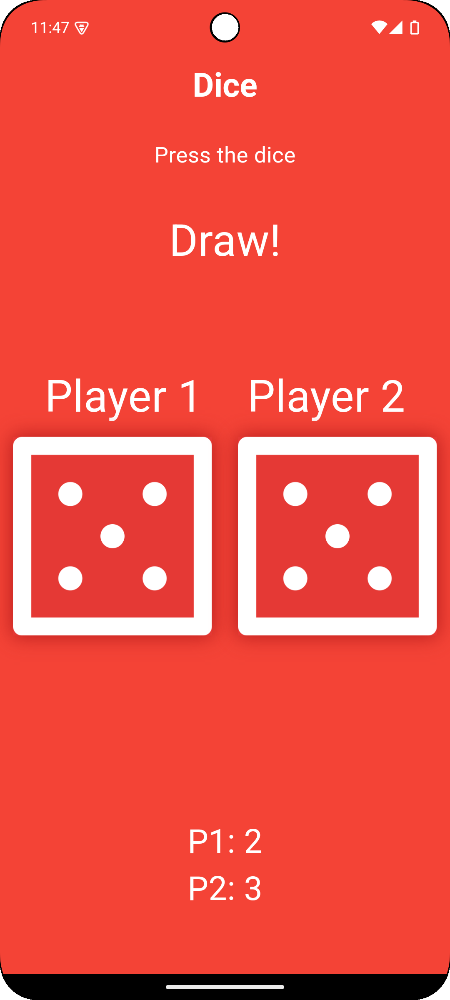
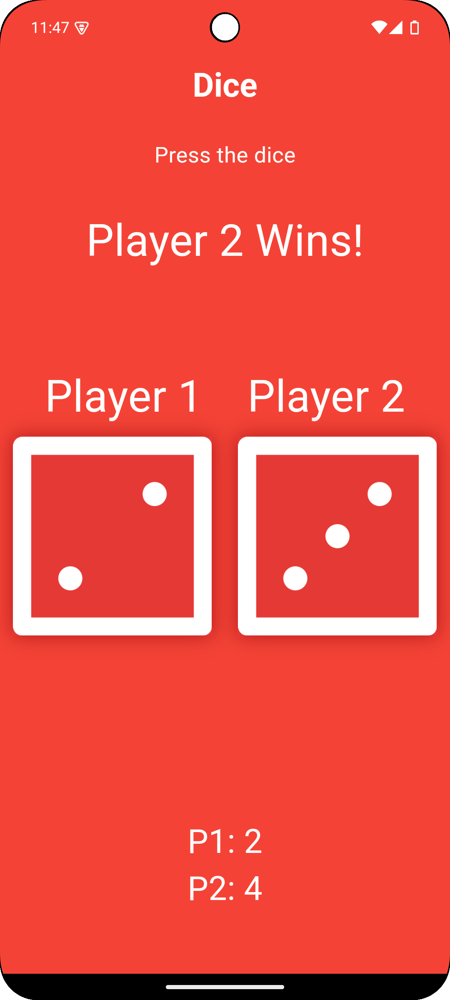

**Dice Challenge App**
================

A simple dice game app built with Flutter

**Overview**
-----------

This app allows two players to play a game of dice. Each player rolls a die, and the player with the higher number wins. If the numbers are the same, it's a draw. The app keeps track of the score and displays it at the bottom of the screen.

**Features**
------------

* Two-player dice game
* Randomly generated dice numbers
* Score keeping feature
* Simple and intuitive user interface

**Screenshots**
--------------

| | | |
| --- | --- | --- |
| | | |

**Technical Details**
--------------------

* Built with Flutter 3.22.2
* Uses Dart programming language

**How to Run**
--------------

1. Clone the repository: `git clone https://github.com/marufimtiaz/flutter_dice_challenge.git`
2. Open the project in Android Studio or Visual Studio Code
3. Make sure you have Flutter installed on your machine. If not, follow the instructions on the [Flutter website](https://flutter.dev/docs/get-started/install) to install it.
4. Run `flutter pub get` in the terminal to get the project dependencies
5. Run `flutter run` to build and run the app on an emulator or physical device
6. If you want to run the app on a physical device, make sure it's connected to your machine and authorized for debugging. You can do this by enabling USB debugging on your device and running `flutter devices` to list the available devices.

**Author**
-------

[Maruf Imtiaz]

